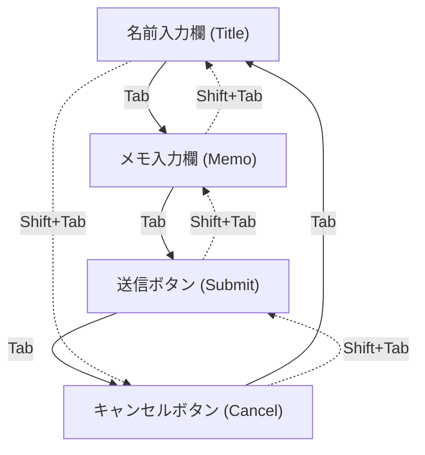

# ランチャー gantt 送信 UI 仕様書

本ドキュメントは、ローカル全文検索アプリケーションのデスクトップランチャーにおける、gantt 連携メモ機能の UI/UX 改善に関する仕様を定義します。

## 改善の目的
従来の「1つのテキストエリアから改行区切りでタスク名とメモを抽出する」という方式は、直感的ではなく、操作ミスが発生しやすい問題がありました。
本改修では、**タスク名（名前）とメモの入力ボックスを明確に分離**し、さらにキーボードから手を離さずに操作可能な**Tab / Shift+Tab によるフォーカス巡回**および**送信・キャンセル操作**を実現し、操作性を飛躍的に向上させます。

---

## 1. UI 構成

### メモ画面のレイアウトイメージ

```
+-------------------------------------------------------------+
|  gantt メモ                                   parent: 0     |
+-------------------------------------------------------------+
|  [ タスク名を入力してください...                         ]  |  <-- 名前入力欄 (Single-line)
+-------------------------------------------------------------+
|  [ メモを入力してください...                             ]  |
|  [                                                       ]  |  <-- メモ入力欄 (Multi-line)
|  [                                                       ]  |
+-------------------------------------------------------------+
|                                    [ キャンセル ]  [ 送信 ] |  <-- 操作ボタン
+-------------------------------------------------------------+
|  (ステータス表示メッセージ)                                 |
+-------------------------------------------------------------+
```

### コントロール詳細

| コントロール名 | 種別 | 仕様・挙動 |
| :--- | :--- | :--- |
| **名前入力欄** (`memo_title_field`) | テキスト入力欄 (Flet: `TextField` / Cocoa: `NSTextField`) | - シングルライン入力<br>- プレースホルダー: `タスク名を入力...`<br>- メモ画面遷移時に自動フォーカスされる |
| **メモ入力欄** (`memo_body_field`) | テキストエリア (Flet: `TextField` / Cocoa: `NSTextView`) | - マルチライン入力<br>- プレースホルダー: `メモを入力...` |
| **送信ボタン** (`memo_submit_button`) | ボタン (Flet: `TextButton` / Cocoa: `NSButton`) | - クリックまたはフォーカス状態で `Enter` キー押下時にタスクを作成して API 送信<br>- 送信成功時は入力値をクリアし、ウィンドウを非表示にする |
| **キャンセルボタン** (`memo_cancel_button`)| ボタン (Flet: `TextButton` / Cocoa: `NSButton`) | - クリックまたはフォーカス状態で `Enter` キー押下時に検索画面へ戻る |

---

## 2. キーボード操作（フォーカス遷移）仕様

Windows (Flet) および macOS (Cocoa / PyObjC) の双方で、統一されたキーボード操作を提供します。

### フォーカス巡回ルール

メモ画面内では、`Tab` および `Shift + Tab` によって以下の順序でフォーカスがループします。



### 特殊キー挙動

- **`Escape` キー**: 
  - メモ画面表示中に `Escape` を押した場合、ランチャーを閉じるのではなく**検索画面に戻ります**。検索画面で再度 `Escape` を押すとランチャーが非表示（最小化）になります。
- **`Enter` キー**:
  - **名前入力欄**: `Enter` を押すと、タスク名が入力されていればそのまま送信を実行します。
  - **メモ入力欄**: マルチラインテキストエリアであるため、`Enter` は「改行」として扱います。
  - **送信/キャンセルボタン**: フォーカスがある状態で `Enter` を押すと、それぞれのボタンアクション（送信 / 画面戻る）を実行します。
- **`Shift + Enter` キー**:
  - メモ画面内のどの入力欄（名前欄・本文欄）にフォーカスがあっても、`Shift + Enter` を押すことで即座にタスク送信を実行できます。
