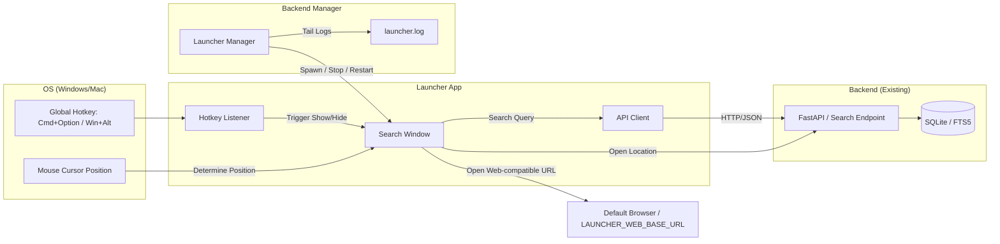

# ランチャーアプリ - アーキテクチャ設計

## 1. 起動モデル (一体型常駐)
バックエンドサーバー（FastAPI）の起動プロセスの一部として、または並列してランチャープロセスを起動します。

### 構成要素
- **Server Process**: SQLite 検索エンジンと API サービスを提供。
- **Launcher Process**: macOS では Cocoa `NSPanel`、その他 OS では Flet UI を提供する。
- **Launcher Manager**: FastAPI lifespan で初期化され、ランチャー子プロセスの起動・停止・再起動・ログ取得を担当する。
- **Global Listener**: macOS では `CGEventTap` を優先し、`NSEvent` monitor と watchdog polling を補助に使う。その他 OS では `pynput` で表示/非表示を制御する。

## 2. システム連携図

## 3. 主要な技術的ポイント

### macOS の表示モデル
macOS では Flet の最小化・復帰が Spaces と相性が悪いため、PyObjC / Cocoa の `NSPanel` を使います。

- `NSWindowCollectionBehaviorCanJoinAllSpaces` でアクティブな仮想デスクトップに表示する。
- HID レベルの `CGEventTap` を優先し、作成できない場合は session レベルへフォールバックする。補助的に `NSEvent` monitor と `CGEventSourceFlagsState` の watchdog polling も使って `Command + Option` を検出する。
- `NSWorkspaceWillSleepNotification` / `NSWorkspaceDidWakeNotification` でスリープ前後を検知し、復帰時に `NSEvent` monitor を再登録する。
- ボーダーレスでも入力できるよう `canBecomeKeyWindow()` / `canBecomeMainWindow()` を `True` にした `LauncherPanel` を使う。

### バックエンドとの通信
初期実装では `LAUNCHER_API_BASE_URL` (既定値 `http://127.0.0.1:8079`) の既存APIを HTTP で呼び出します。

- macOS 検索: `POST /api/search`
- Windows / Linux 検索: `POST /api/search/indexed`
- アクセス数更新: `POST /api/search/click`
- 保存場所表示: `POST /api/files/open-location`
- ランチャー管理: `GET /api/launcher/status`, `POST /api/launcher/start`, `POST /api/launcher/stop`, `POST /api/launcher/restart`
- 検索結果を開く: `LAUNCHER_WEB_BASE_URL` を基準に、ファイルは `/api/fullpath?path=...`、フォルダは `/?path=...` を既定ブラウザで開く。既定値は `http://localhost:8001`。

検索のプラットフォーム別挙動は次の通りです。

- macOS: `/api/search` に `full_path=""`, `search_all_enabled=false`, `skip_refresh=false`, `index_depth=5` を渡し、登録済み検索対象フォルダの更新を許可する。
- Windows / Linux: `/api/search/indexed` に `folder_path=""` を渡し、既存インデックスだけを高速に検索する。

### ランチャーの Python 環境
ランチャー子プロセスはプロジェクトルート `.venv` の Python を優先し、存在しない場合はバックエンド実行中の Python へフォールバックします。`backend/requirements.txt` にはランチャー依存も含めています。`launcher/requirements.txt` はランチャー単体環境を最小構成で用意する場合に使います。

### UI とテスト境界
UI 依存は `launcher_app.ui` に閉じ込め、以下の処理はテストできるように分離します。

- `launcher_app.api.client`: 既存 FastAPI との JSON 通信
- `launcher_app.ui.native_mac`: Web アプリ互換 URL の生成
- `app.services.launcher_service`: バックエンド配下のランチャープロセス管理とログ末尾取得
- `launcher_app.services.file_actions`: OS 標準アプリ起動・Finder/Explorer 表示
- `launcher_app.services.hotkeys`: OS ごとのホットキー定義と `pynput` 遅延読み込み
